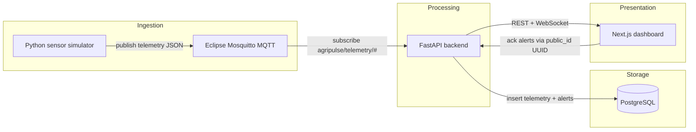

# AgriPulse

End-to-end **IoT cold-chain telemetry** platform for perishable goods in transit (produce / medical supplies) moving from regional Victoria into Melbourne.

AgriPulse demonstrates event-driven ingestion, async processing, hybrid public identifiers, and a live operations dashboard — the kind of production-shaped portfolio project Melbourne employers look for in Cloud / Data / Software Engineering roles.

---

## Architecture



**Data path:** Simulator → MQTT → FastAPI worker → PostgreSQL → REST/WebSocket → Dashboard

---

## Tech stack

| Layer | Technology |
|-------|------------|
| Sensor simulation | Python, `paho-mqtt` |
| Message broker | Eclipse Mosquitto 2.0 |
| Backend API | FastAPI, asyncpg, WebSocket hub |
| Database | PostgreSQL 15 (`telemetry`, `alerts`) |
| Frontend | Next.js 15, Tailwind CSS, Recharts |
| Infrastructure | Docker Compose (one-command local stack) |

---

## Repository structure

```text
agripulse-telemetry/
├── backend/           # FastAPI MQTT ingest + REST/WS API
├── database/          # SQL schema + public_id migration
├── frontend/          # Next.js live ops dashboard
├── mosquitto/         # Broker config
├── simulator/         # IoT truck telemetry publisher
├── docker-compose.yml # Full multi-service stack
├── .env.example       # Safe local defaults (copy to .env)
└── README.md
```

---

## Quick start (one command)

**Requirements:** Docker + Docker Compose

```bash
git clone https://github.com/LisunKhan/AgriPulse.git
cd AgriPulse

cp .env.example .env
# optional: edit .env passwords / ports before first run

docker compose up -d --build
```

| Service | URL |
|---------|-----|
| Dashboard | http://localhost:3000 |
| API docs (Swagger) | http://localhost:8000/docs |
| Health | http://localhost:8000/health |
| MQTT | `localhost:1883` |
| Postgres | `localhost:5432` |

Stop:

```bash
docker compose down
```

Reset DB volumes (destructive):

```bash
docker compose down -v
```

Useful logs:

```bash
docker compose logs -f simulator backend frontend
```

---

## Environment configuration

Copy the example file and adjust as needed:

```bash
cp .env.example .env
```

| Variable | Purpose |
|----------|---------|
| `POSTGRES_USER` / `POSTGRES_PASSWORD` / `POSTGRES_DB` | Database credentials |
| `DATABASE_URL` | Backend connection string |
| `MQTT_HOST` / `MQTT_PORT` / `MQTT_TOPIC` | Broker settings |
| `TEMP_MIN_C` / `TEMP_MAX_C` | Cold-chain thresholds |
| `ALERT_COOLDOWN_SEC` | Prevent alert spam per device/type |
| `NEXT_PUBLIC_API_BASE_URL` | Browser → API base URL |
| `NEXT_PUBLIC_WS_URL` | Browser → live WebSocket |

**Never commit `.env`.** Only `.env.example` belongs in git.

---

## API surface (Milestone 3)

| Method | Path | Description |
|--------|------|-------------|
| `GET` | `/health` | DB + MQTT status |
| `GET` | `/telemetry/latest` | Newest reading per device |
| `GET` | `/telemetry?device_id=&limit=` | History |
| `GET` | `/alerts?acknowledged=false` | Open alerts |
| `POST` | `/alerts/{public_id}/ack` | Acknowledge alert |
| `WS` | `/ws/telemetry` | Live telemetry + alert events |

Identifiers:

- **Internal PK:** `BIGSERIAL` (fast inserts, DB joins)
- **Public API ID:** `public_id` UUID (safe to expose in UI / ack routes)
- **Business key:** `device_id` (e.g. `truck_01`)

---

## Design decisions

1. **MQTT over HTTP for sensors** — lightweight, pub/sub friendly for IoT streams; backend fans out to DB and WebSocket clients.
2. **FastAPI async worker** — MQTT client runs in a background thread; persistence and broadcasts use the asyncio loop without blocking request handlers.
3. **Thresholds as first-class backend logic** — cold-chain band (default 2–8°C) is enforced server-side; simulator status is advisory, API is source of truth.
4. **Alert cooldown** — reduces duplicate alerts when a truck stays out of band for many publish cycles.
5. **Hybrid IDs** — keep sequential internals for performance; expose UUID `public_id` for portfolio-grade API hygiene ahead of the dashboard.
6. **Docker Compose first** — recruiters / reviewers can reproduce the full pipeline locally with one command before any cloud deploy.
7. **Browser talks to host-mapped ports** — frontend build args use `localhost:8000` so the UI works from the host browser while services run in Compose.

---

## Local development (optional)

Backend (outside Compose):

```bash
cd backend
python -m venv .venv && source .venv/bin/activate
pip install -r requirements.txt
uvicorn app.main:app --reload --port 8000
```

Frontend:

```bash
cd frontend
npm install
NEXT_PUBLIC_API_BASE_URL=http://localhost:8000 \
NEXT_PUBLIC_WS_URL=ws://localhost:8000/ws/telemetry \
npm run dev
```

---

## Roadmap status

- [x] Milestone 1 — Sensor simulator  
- [x] Milestone 2 — Mosquitto + PostgreSQL  
- [x] Milestone 3 — FastAPI ingest + API  
- [x] Milestone 4 — Next.js live dashboard  
- [x] Milestone 5a — README, architecture, `.env.example`, repo hygiene  
- [ ] Milestone 5b — Cloud deploy + live demo link  

---

## License

Portfolio / educational project by [Md Lisun-Ul-Islam](https://github.com/LisunKhan).
